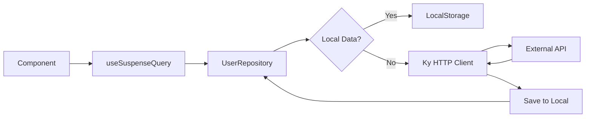

# React Data Fetching Architecture

이 프로젝트는 **React** 환경에서 **데이터 패칭(Data Fetching)**과 **상태 관리(State Management)**를 가장 효율적이고 모던하게 처리하기 위한 아키텍처를 구현한 예제입니다.

**Clean Architecture**의 사상을 받아들여 UI와 비즈니스 로직, 데이터 소스 계층을 명확히 분리하고, **Ky**와 **Tanstack Query**를 조합하여 강력한 에러 핸들링과 캐싱 전략을 구축했습니다.

## 🛠 Tech Stack

- **Core**: React 18, TypeScript, Vite
- **Data Fetching**: [Ky](https://github.com/sindresorhus/ky) (HTTP Client), [Axios 대신 선택]
- **Validation**: [Zod](https://zod.dev/) (Runtime Schema Validation)
- **State Management**: [Tanstack Query v5](https://tanstack.com/query/latest) (Server State)
- **Pattern**: Repository Pattern
- **Utils**: React Error Boundary

## 🏗 Architecture & Design Decisions

### 1. Repository Pattern (데이터 계층 분리)
React 컴포넌트(`UserProfile`)는 데이터를 어디서 가져오는지 알 필요가 없습니다. 단순히 "사용자 정보를 달라"고 요청할 뿐입니다.
`Repository` 계층이 그 요청을 받아 **Local Storage(캐시)**에 데이터가 있는지 확인하고, 없으면 **Remote API**를 호출합니다.



### 2. Ky over Axios (HTTP Client)
왜 **Axios** 대신 **Ky**를 선택했나요?
- **Modern Standard**: 구형 `XMLHttpRequest`가 아닌 모던 브라우저 표준 `fetch` API 기반입니다.
- **Lightweight**: 번들 사이즈가 훨씬 작습니다.
- **Better Hooks**: `beforeError` 같은 훅을 통해 에러를 더 세련되게 가공할 수 있습니다.
- **Native Retry**: 재시도(Retry) 로직이 내장되어 있습니다.

### 3. Centralized Error Handling (에러 처리 전략)
HTTP 에러, 네트워크 끊김, 타임아웃 등 다양한 에러 상황을 명확하게 구분하기 위해 커스텀 에러 클래스를 정의했습니다.
`Ky`의 인터셉터(`hooks.beforeError`)에서 모든 에러를 아래 3가지 유형으로 정규화(Normalize)합니다.

- **`NetworkError`**: 인터넷 연결 끊김 등 아예 요청이 실패한 경우
- **`TimeoutError`**: 서버 응답이 지정된 시간 내에 오지 않은 경우
- **`APIError`**: 서버가 4xx, 5xx 응답을 내려준 경우

### 4. Zod Runtime Validation (런타임 데이터 검증)
TypeScript는 컴파일 타임에만 타입을 체크하지만, 실제 서버에서 내려오는 데이터가 우리가 예상한 타입과 다를 수 있습니다.
이 프로젝트에서는 **Zod**를 사용하여 API 응답 데이터를 런타임에 검증합니다.

```typescript
// Define Schema
export const UserSchema = z.object({
  id: z.number(),
  email: z.string().email(), // 이메일 형식 검증
  // ...
});

// Validate in Repository
const rawData = await api.get('...').json();
const user = UserSchema.parse(rawData); // 형식이 맞지 않으면 ZodError 발생 -> ErrorBoundary 포착
```

이를 통해 UI의 `ErrorBoundary`에서는 에러 타입에 따라 사용자에게 정확한 가이드를 제공할 수 있습니다.

## 📂 Project Structure

```bash
src/
├── api/
│   ├── client.ts       # Ky 인스턴스 설정 (Interceptor, Timeout 등)
│   └── errors.ts       # 커스텀 에러 클래스 정의 (APIError 등)
├── repositories/
│   ├── IUserRepository.ts  # Repository 인터페이스 (DIP 준수)
│   └── UserRepository.ts   # 구현체 (Local/Remote 분기 로직 포함)
├── hooks/
│   └── queries/        # Tanstack Query 훅 모음 (useUser 등)
├── components/
│   ├── ErrorFallback.tsx   # 에러 발생 시 보여줄 Fallback UI
│   └── UserProfile.tsx     # 데이터 표시 UI (Suspense 지원)
├── App.tsx             # 메인 앱 (ErrorBoundary & Suspense 구성)
└── main.tsx            # Entry Point (QueryClient 설정)
```

## 🚀 How to Run

```bash
# 의존성 설치
pnpm install

# 개발 서버 실행
pnpm dev
```

## 🧪 Testing Scenarios

1.  **Happy Path**: `User 1` 버튼 클릭 -> 로딩(Suspense) -> 데이터 표시. 새로고침 시 로컬 스토리지에서 즉시 로드.
2.  **API Error**: `User 99999` 클릭 -> 404 발생 -> `APIError` throw -> ErrorBoundary가 "Error 404" 표시.
3.  **Network Error**: 개발자 도구 Network 탭에서 `Offline` 설정 -> 버튼 클릭 -> `NetworkError` throw -> "인터넷 연결을 확인해주세요" 표시.
